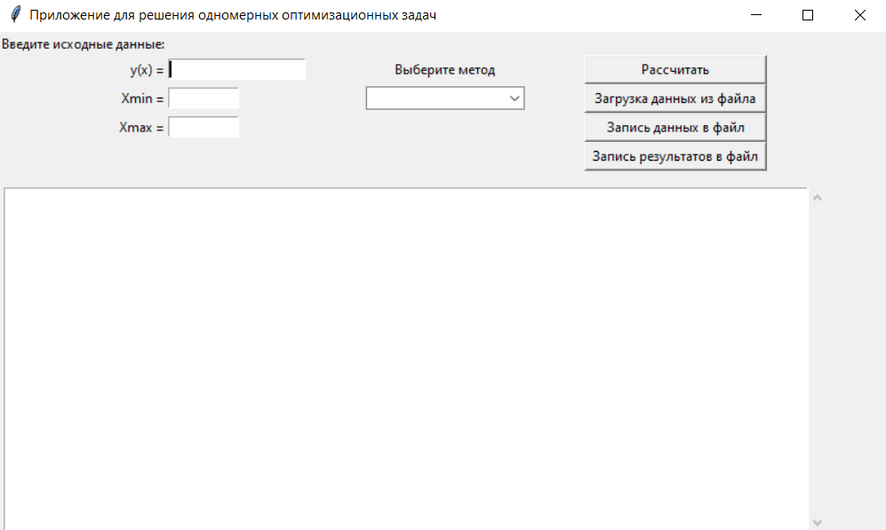
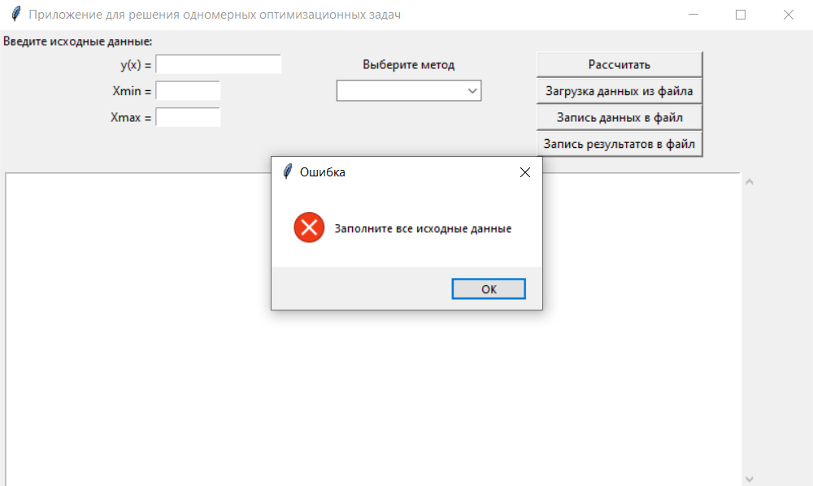
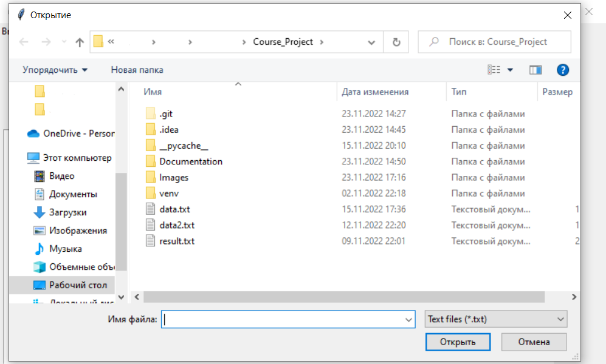
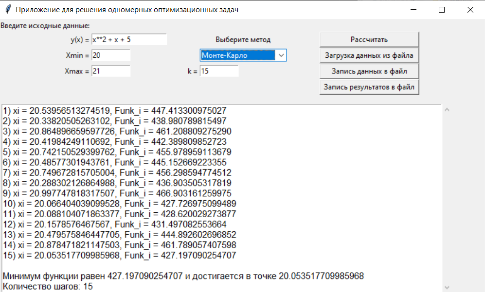

# Курсовой проект

## Описание

Приложиние для решения одномерных оптимизационных задач методами Монте-Карло, дихотомии, золотого сечения, Фибоначчи.

В приложении предусмотрена загрузка данных из файла и запись данных и результатов в файл с расширением ".txt".

## Теория

### Метод Монте-Карло

Метод Мо́нте-Ка́рло (ММК) − численный метод, заключающийся в том, что с использованием генератора случайных величин
выбираются k точек, в которых будет высчитываться значение функции. Среди полученных значений функции выбирается
минимальное, что и будет являться результатом.

### Метод дихотомии

Метод дихотомии является методом прямого поиска. В нем при поиске экстремума целевой функции используются только
вычисленные значения целевой функции. Пусть дана функция F(x). Необходимо найти точку, в которой значение функции будет
минимальным на заданном интервале [a, b] с заданной точностью ε.

Алгоритм метода:

1. На каждом шаге поиска делим отрезок [a, b] пополам, x = (a + b)/2.
2. Вычисляем значение функции в окрестности вычисленной точки x, т.е. F1 = F(x + Δ) и F2 = F(x − Δ).
3. Сравниваем F1 и F2 и отбрасываем одну из половинок отрезка [a, b]
   Если F1<F2, то отбрасываем отрезок [x, b], тогда b=x. Иначе отбрасываем отрезок [a, x], тогда a=x.
4. Деление отрезка продолжается, пока его длина не станет меньше заданной точности ε.

### Метод золотого сечения

Золотым сечением отрезка называют такое его деление на две неравные части, при котором отношение длины всего отрезка к
длине его большей части равно отношению длины большей части к длине меньшей.

Алгоритм метода:

1. Вычисляем точки, в которых будем рассчитывать значение функции F(x).

   x_1= a + (b - a) / t, x_2= b - (b - a) / t.

   t = (1+√5)/2≈1,618034
2. Вычисляем F1 = F(x_1) и F2 = F(x_2).
3. Сравниваем F1 и F2 и отбрасываем одну из частей отрезка [a, b]
   Если F1<F2, то отбрасываем отрезок [x_2, b], тогда b=x_2. Иначе отбрасываем отрезок [a, x_1], тогда a=x_1.
4. Деление отрезка продолжается, пока его длина не станет меньше заданной точности ε.

### Метод Фибоначчи

Метод Фибоначчи сочетает преимущество симметричного расположения внутренних точек x_1, x_2 на отрезке [а, b]
относительно его середины, реализованное в методах дихотомии и золотого сечения, с возможностью на каждом шаге изменять
отношение l_k/l_(k+1) длин сокращаемого и нового отрезков. 

Алгоритм метода:
1. Вычисляем точки, в которых будем рассчитывать значение функции F(x). α_i= a + F_(k-i)  / F_(k+1), β_i= a + F_(k+1-i)  /
F_(k+1). 
2. Вычисляем F1 = F(α_i) и F2 = F(β_i). 
3. Сравниваем F1 и F2 и отбрасываем одну из частей отрезка [a, b]
Если F1<F2, то отбрасываем отрезок [β_i, b], тогда b=β_i. Иначе отбрасываем отрезок [a, α_i], тогда a=α_i. 
4. Деление отрезка продолжается k−1 раз.

## Работа с приложением

### Базовое окно

### Окно ошибки

Все окна ошибки имеют одинаковый вид. При вводе поля они могут всплывать для регулировки типа вводимого значения (
Например, при попытке ввести дробное значение в поле, где ожидается целое). Остальные окна ошибок всплывают после
нажатия на кнопку.

### Окно для выбора файла

Диалоговое окно разрешает выбрать только те файлы, которые содержат расширение ".txt".

### Результат рассчетов

В поле результата выводится пошаговый ход работы программы, а затем и сам результат.